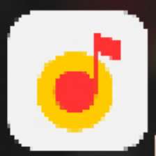
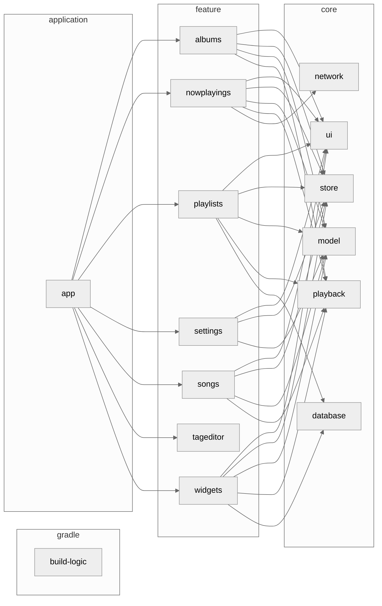

# 🎵 ATOM Music app

This is a music application created
using Kotlin and Jetpack Compose for ATOM OS IVI

### Libraries Used
* Media3
* Jetpack Compose
* Retrofit
* Koin
* Coil
* Room
* Jaudio-Tagger

# Features

1. Flexible queueing functionality
2. Tag Editor (mp3, wav, m4a)
3. Create playlists
4. Sleep Timer
5. Create home screen shortcuts for your favorite playlists
6. Synchronized lyrics
7. Automatically fetches synchronized lyrics for songs without lyrics
8. Dynamic Color Scheme, and theming options
9. Blacklist Folders
10. Create a playlist from the current queue 
11. Circular and rectangular home screen widgets (currently in alpha)

# Project modules
```
Music project
├── app
│   ├── src
│   │   ├── androidTest
│   │   ├── main
│   │   └── test
├── build-logic
├── core
│   ├── database
│   ├── model
│   ├── network
│   ├── playback
│   ├── store
│   ├── testing
│   └── ui
├── feature
│   ├── albums
│   ├── nowplaying
│   ├── playlists
│   ├── settings
│   ├── songs
│   ├── tageditor
│   └── widgets
```

# Dependencies


